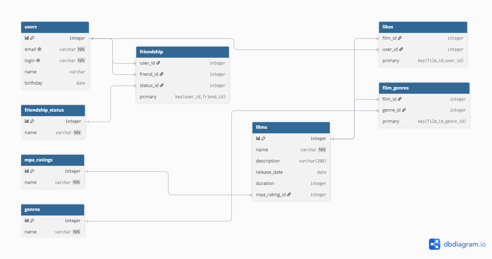

# java-filmorate
## Схема базы данных


### Пояснение к схеме:
* **users** — хранит данные пользователей.
* **films** — содержит информацию о фильмах.
* **mpa_ratings** — таблица рейтингов.
* **genres** — таблица жанров кино.
* **film_genres** — таблица жанров конкретных фильмов.
* **likes** — таблица лайков пользователей к фильмам.
* **friendship** — таблица социальных связей.

---

## Примеры SQL-запросов

### 1. Операции с пользователями
* **Получение всех пользователей:**
  ```sql
  SELECT * FROM users;
  ```
* **Получение списка друзей конкретного пользователя (id = 1):**
  ```sql
  SELECT u.* 
  FROM users AS u
  JOIN friendship AS f ON u.id = f.friend_id
  WHERE f.user_id = 1;
  ```

### 2. Операции с фильмами
* **Получение фильма по его уникальному ID:**
  ```sql
  SELECT * FROM films
  WHERE id = 1;
  ```
* **Получение списка жанров для конкретного фильма (id = 1):**
  ```sql
  SELECT g.id, g.name 
  FROM film_genres AS fg
  JOIN genres AS g ON fg.genre_id = g.id
  WHERE fg.film_id = 1
  ORDER BY g.id ASC;
  ```
* **Вывод Топ-10 самых популярных фильмов:**
  ```sql
  SELECT f.*, m.name AS mpa_name, COUNT(l.user_id) AS like_count
  FROM films AS f
  LEFT JOIN mpa_ratings AS m ON f.mpa_rating_id = m.id
  LEFT JOIN likes AS l ON f.id = l.film_id
  GROUP BY f.id, f.name, f.description, f.release_date, f.duration, f.mpa_rating_id, m.name
  ORDER BY like_count DESC, f.id ASC
  LIMIT 10;
  ```